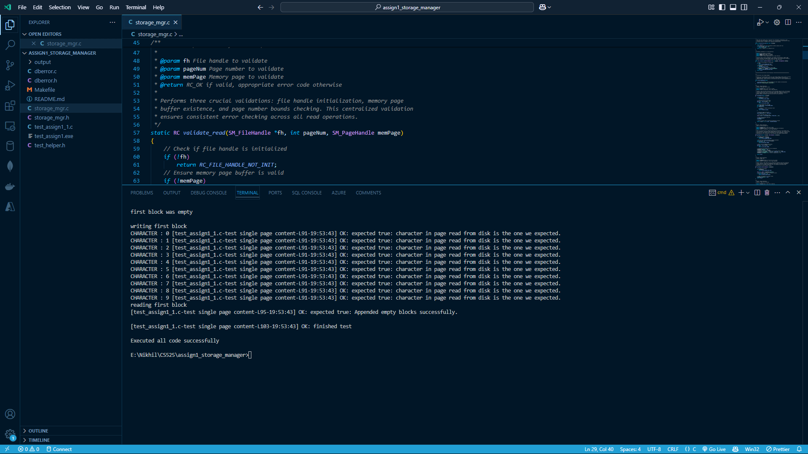

# Assignment 1: Storage Manager


## Overview
The Storage Manager is a lightweight module designed for efficient page file management. It allows applications to create, open, read, write, close, and delete fixed-size page files, ensuring structured file operations while maintaining metadata integrity.

## Purpose
The primary objective of the Storage Manager is to abstract common file operations, making it easier to handle large datasets within structured files. It supports efficient reading and writing while maintaining essential file properties like name, page count, and current position.

## Key Features
- **File Management:** Create, open, close, and delete files.
- **Page Operations:** Read and write fixed-size pages efficiently.
- **Capacity Management:** Append empty pages and expand file size as required.
- **Metadata Handling:** Maintain structured file properties.
- **Error Reporting:** Comprehensive error handling for reliable operations.

## Interface
The interface is defined in `storage_mgr.h` and includes the following functions:

### File Operations
- `void initStorageManager(void)`: Initializes the storage manager system.
- `RC createPageFile(char *fileName)`: Creates a new page file with an initial empty page.
- `RC openPageFile(char *fileName, SM_FileHandle *fHandle)`: Opens an existing page file.
- `RC closePageFile(SM_FileHandle *fHandle)`: Closes an open file.
- `RC destroyPageFile(char *fileName)`: Deletes a specified page file.

### Page Reading
- `RC readBlock(int pageNum, SM_FileHandle *fHandle, SM_PageHandle memPage)`: Reads a specific page into memory.
- `int getBlockPos(SM_FileHandle *fHandle)`: Retrieves the current page position.
- `RC readFirstBlock(SM_FileHandle *fHandle, SM_PageHandle memPage)`: Reads the first page.
- `RC readPreviousBlock(SM_FileHandle *fHandle, SM_PageHandle memPage)`: Reads the previous page.
- `RC readCurrentBlock(SM_FileHandle *fHandle, SM_PageHandle memPage)`: Reads the current page.
- `RC readNextBlock(SM_FileHandle *fHandle, SM_PageHandle memPage)`: Reads the next page.
- `RC readLastBlock(SM_FileHandle *fHandle, SM_PageHandle memPage)`: Reads the last page.

### Page Writing
- `RC writeBlock(int pageNum, SM_FileHandle *fHandle, SM_PageHandle memPage)`: Writes to a specific page.
- `RC writeCurrentBlock(SM_FileHandle *fHandle, SM_PageHandle memPage)`: Writes to the current page.
- `RC appendEmptyBlock(SM_FileHandle *fHandle)`: Appends a new empty page.
- `RC ensureCapacity(int numberOfPages, SM_FileHandle *fHandle)`: Ensures the file has at least the specified number of pages.

## Data Structures
### `SM_FileHandle`
Represents an open file with the following attributes:
- `char *fileName`: The file name.
- `int totalNumPages`: The total number of pages in the file.
- `int curPagePos`: The current position in the file.
- `void *mgmtInfo`: Additional management information.

### `SM_PageHandle`
A pointer to a memory block storing page content.

## Implementation Details
- **Page Size:** Defined in `dberror.h`.
- **Error Codes:** Defined in `dberror.h`, providing status codes for operations.
- **Additional Error Code:** `#define RC_DESTROY_FILE_FAILED -4` added to `dberror.h`.

## Project Structure
```
assign1/
│
├── README.txt
├── dberror.c
├── dberror.h
├── storage_mgr.c
├── storage_mgr.h
├── test_assign1_1.c
├── test_helper.h
└── Makefile
```

### File Descriptions
- `storage_mgr.c/.h`: Implements storage management functionalities.
- `dberror.c/.h`: Defines error handling mechanisms.
- `test_assign1_1.c`: Contains test cases.
- `test_helper.h`: Provides additional testing support.
- `Makefile`: Compilation instructions.

## Compilation & Execution
### Build the Project:
1. Open a terminal in the project directory.
2. Clean old file
   ```
   make clean
   ```
3. Compile using:
   ```bash
   make
   ```
4. Execute:
   ```bash
   ./test_assign1
   ```


## Testing & Debugging
- `test_assign1_1.c` provides test coverage for all major functionalities.
- Additional tests are recommended to ensure robustness.
- Debugging tools can help identify and fix issues.

## Contribution Table
| Roll Number | Name | Contribution |
|-------------|------|--------------|
| A20594926 | Rayyan Maindargi | 33.33 % |
|A20576257| Purnendu Kale | 33.33 % |
| A20577685 | Nijgururaj Ashtagi | 33.33 % |

## Conclusion
The Storage Manager efficiently manages structured page files, supporting key file operations while ensuring metadata consistency and error handling. The implementation provides a reliable and scalable approach to handling large structured datasets.

## Output
