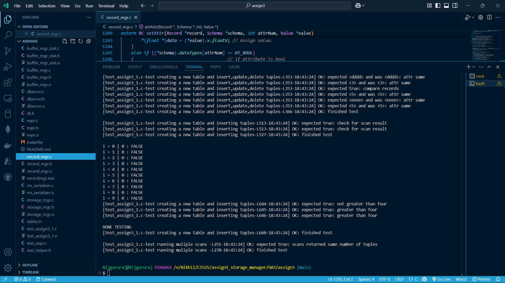
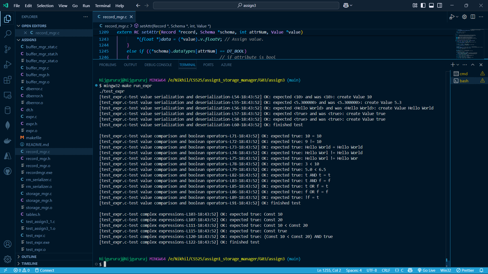

# Record Manager

## Overview
The Record Manager is a component that handles record-level operations for a database system. It provides functionality for creating, deleting, updating, and retrieving records within tables, as well as scanning through tables based on conditions. The implementation uses a buffer pool for efficient page management and supports schema-based table structures.

Video Link: https://www.loom.com/share/3abecdb90c1347d0b55178e1d82ea670?sid=93554533-deef-40b6-8d16-e758dbc574f9

## Contribution Table

| Hawk Id | Name | Contribution | Percentage |
|---------- |------|--------------|------------|
| A20577685 | Nijgururaj Ashtagi | Implementation of table management and record handling | 33.3% |
| A20576257 | Purnendu Kale | Implementation of scan operations and schema handling | 33.3% |
| A20594926 | Rayyan Maindargi | Implementation of attribute operations and testing | 33.3% |

## Compilation and Execution

```bash
make clean       # Clean previous build files
make             # Compile the project
make run         # Run the primary test case
make test_expr   # Compile expressions test case
make run_expr    # Run the expressions test case
```

## Core Functions

### Table and Manager Functions
- `initRecordManager`: Initializes the record manager by setting up the storage manager.
- `shutdownRecordManager`: Shuts down the record manager and releases allocated resources.
- `createTable`: Creates a new table with the specified name and schema.
- `openTable`: Opens an existing table and loads its metadata.
- `closeTable`: Closes a table and releases its buffer pool resources.
- `deleteTable`: Deletes a table by removing its underlying page file.
- `getNumTuples`: Returns the number of records currently stored in the table.

### Record Handling in Table
- `insertRecord`: Inserts a new record into the table by finding an available slot.
- `deleteRecord`: Deletes a record by marking its slot as available.
- `updateRecord`: Updates an existing record with new data.
- `getRecord`: Retrieves a record from the table based on its RID.

### Scans
- `startScan`: Initiates a table scan with a specified condition.
- `next`: Retrieves the next record matching the scan condition.
- `closeScan`: Ends a table scan and cleans up resources.

### Dealing with Schemas
- `createSchema`: Creates a new schema object with specified attributes.
- `freeSchema`: Deallocates memory used by a schema object.
- `getRecordSize`: Calculates the size of a record based on its schema definition.

### Dealing with Records and Attribute Values
- `createRecord`: Creates a new record with memory allocation based on the schema.
- `freeRecord`: Deallocates memory used by a record object.
- `getAttr`: Extracts the value of a specific attribute from a record.
- `setAttr`: Sets the value of a specific attribute in a record.
- `getAttributeOffset`: Calculates the byte offset of a specific attribute within a record.

## Output

