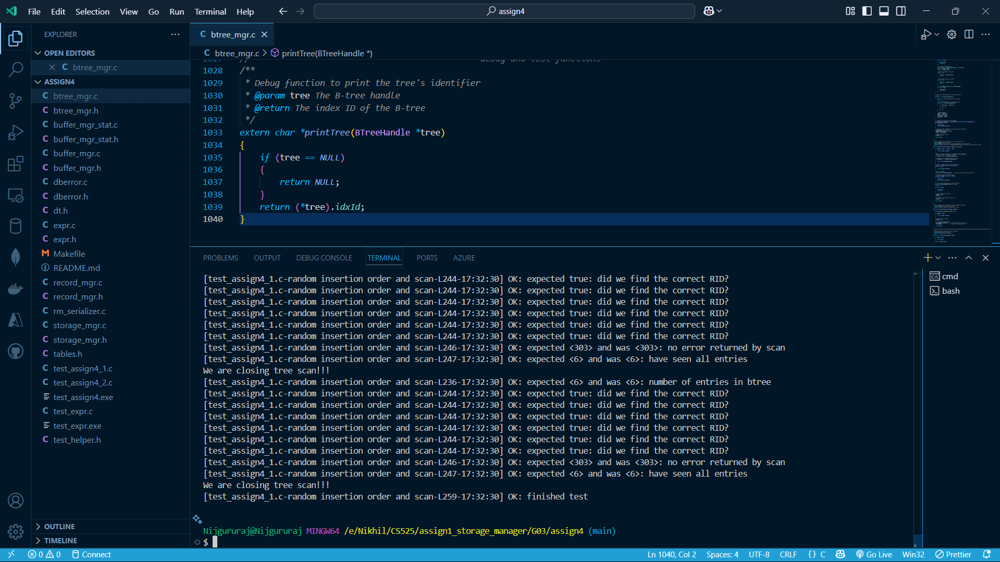
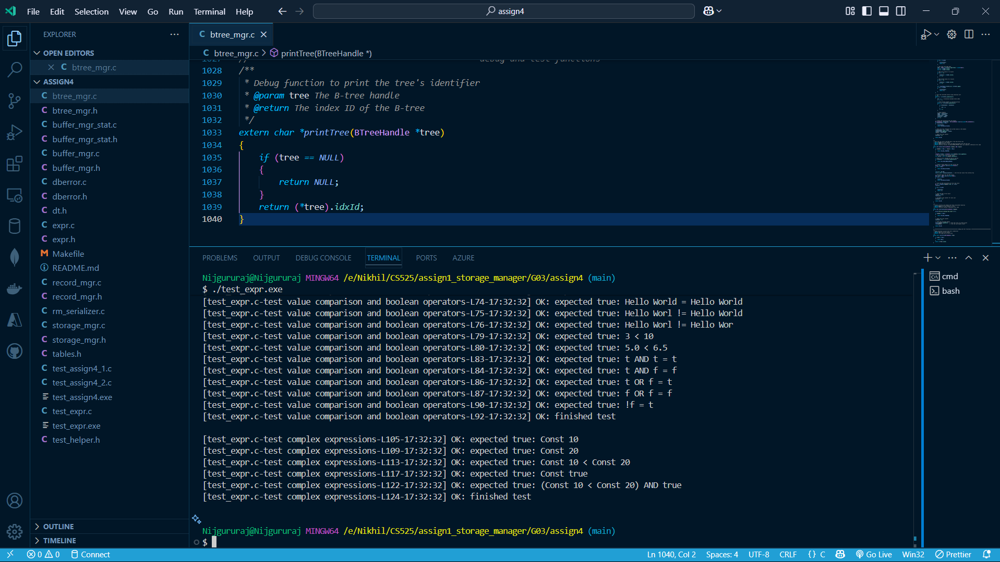

# B-Tree Implementation

## Overview
This project implements a B-Tree data structure for efficient database indexing operations. The B-Tree provides logarithmic time complexity for data insertion, deletion, and lookup operations, making it ideal for database management systems.

The implementation includes core B-Tree operations such as:
- Creating and deleting B-Tree indexes
- Opening and closing B-Tree handles
- Key insertion and deletion
- Key lookup
- Sequential scanning in sorted order

The code is organized to handle buffer management, storage, and B-Tree operations in a modular way, allowing for efficient memory usage and disk access patterns.

## Demonstration Video
Video Demonstration Link: https://www.loom.com/share/e0c54fadefcf49a996f774c652187806?sid=38475035-13e3-4c9e-8389-f2c6a354d861

## Contribution Table

| Hawk Id | Name | Contribution | Percentage |
|---------|------|-------------|------------|
| A20577685 | Nijgururaj Ashtagi | Implementation of B-Tree operations and node management	 | 33.3% |
| A20576257 | Purnendu Kale | Implementation of scan operations and buffer management	 | 33.3% |
| A20594926 | Rayyan Maindargi | Implementation of key operations and testing | 33.3% |

## Compilation and Execution

```
make clean       # Clean previous build files
make             # Compile the project
./test_assign4   # Run the primary test case
./run_expr       # Run the expressions test case
```

## Implementation Details

### B-Tree Structure
The B-Tree is implemented using a node-based structure where each node can contain up to two key values and three child pointers. The implementation supports:
- Leaf nodes for storing actual key-value pairs
- Internal nodes for navigating the tree
- Balanced tree properties to ensure O(log n) operations


### B-Tree Index Manager: Functions and Data Structures

#### 1. Data Structures and Global Variables
- Global variable `lastPage` to track the last accessed page
- Constant `INIT_RID` with invalid page and slot numbers
- Counter `scanCount` for scan operations
- `Node` structure for B-tree nodes with fields for parent, leaf status, and key-value pairs
- `TreeInfo` structure to hold B-tree metadata including buffer pool and tree statistics

#### 2. Helper Functions
- `checkDataType`: Verifies if the provided data type is an integer type
- `initializeNewNode`: Sets up a new B-tree node with specified parameters
- `handlePagePinning`: Manages page pinning operations with optional dirty marking

#### 3. Index Manager Initialization and Shutdown
- `initIndexManager`: Initializes the index manager
- `shutdownIndexManager`: Shuts down the index manager

#### 4. B-tree Creation and Management
- `createBtree`: Creates a new B-tree index file with specified key type and order
- `openBtree`: Opens an existing B-tree index and initializes the tree handle
- `closeBtree`: Closes a B-tree index and frees allocated memory
- `deleteBtree`: Removes a B-tree index file from the filesystem

#### 5. B-tree Information Access
- `getNumNodes`: Returns the number of nodes in the B-tree
- `getNumEntries`: Returns the number of key-value entries stored in the B-tree
- `getKeyType`: Returns the data type of keys stored in the B-tree

#### 6. Key Operations
- `findKey`: Searches for a key in the B-tree and returns its associated RID
- `insertKey`: Adds a new key-RID pair to the B-tree, creating new nodes as needed
- `deleteKey`: Removes a key from the B-tree and reorganizes nodes as necessary

#### 7. Tree Scanning Operations
- `openTreeScan`: Creates a scan handle for traversing the B-tree in sorted order
- `nextEntry`: Retrieves the next key-RID pair from an active tree scan
- `closeTreeScan`: Closes a B-tree scan handle and frees associated resources

#### 8. Debug Functions
- `printTree`: Debug function that returns the B-tree's identifier


## Key Files and Functions

- `btree_mgr.h/c`: Core B-Tree operations (create, delete, insert, find)
- `buffer_mgr.h/c`: Buffer pool management for efficient page handling
- `storage_mgr.h/c`: Low-level disk operations for the B-Tree
- `expr.h/c`: Expression evaluation functionality for testing

## Output

